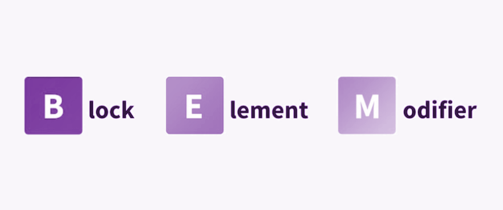

[Diapositivas](recursos/wd-s6-BEM.pptx.pdf)

---

Vamos a ver una metodología de nomenclatura que nos va a ayudar a no volvernos locos con los nombres que le ponemos a nuestras clases css, de este modo, podremos trabajar en ficheros css mucho más limpios y legibles.

## BEM



La metodología BEM busca un enfoque basado en componentes, sugiriendo llamar a las clases de la siguiente manera:

 

```css
/* BLOQUE__ELEMENTO--MODIFICADOR */

.card__header {}
.card__body {}
.card__logo--small {}

```

 

### BLOQUES

- Cada bloque debe tener valor semántico por si mismo.
- Pueden anidarse hasta el infinito sin problemas de profundidad

 

```html
<!-- BIEN -->
<div class="list"></div>
    
<!-- MAL -->
<div class = "big-text"> </div>

```

 

### ELEMENTOS

- Un elemento es cada parte del bloque que no puede usarse por separado.
- Al igual que los bloques, el nombre del elemento hace referencia al elemento (texto, input…) no a su apariencia o estado.
- Usaremos la siguiente sintaxis:

  

```html
<!-- ejemplo 1 -->
<ul class="list">
	<li class="list__item">ITEM 1</li>
	<li class="list__item">ITEM 2</li>
</ul>

<!-- ejemplo 2 -->

<form class="login-form">
	<input class="login-form__input">
	<button class="login-form__button">
</form>
```

 

- De igual manera que los bloques, cada uno de los elementos puede anidarse entre elementos infinitamente. Aunque hay que tener en cuenta que cada sub-elemento también forma parte del bloque

   

```html
<!-- incorrecto -->
<form class="login-form">
	<div class="login-form__content">
		<input class="login-form__content__input">
		<button class="login-form__content__button">
	</div>
</form>

<!-- correcto -->

<form class="login-form">
	<div class="login-form__content">
		<input class="login-form__input">
		<button class="login-form__button">
	</div>
</form>
```

 

### MODIFICADORES

- Los modificadores nos ayudan a definir apariencia (color, tamaño…), un estado (focus, disabled…) o un comportamiento
- Usaremos la siguiente sintaxis:

   

```html
<form class="login-form login-form--focused">
	<div class="login-form__content">
		<input class="login-form__input">
		<button class="login-form__button login-form__button--disabled">
	</div>
</form>
```

  

## EJEMPLO

Vamos a poner un ejemplo para entender esto de BEM, imaginaos que tenemos a Bender como si fuera un componente.

    

```html
<div class="bender">
	<div class="bender__head"></div>
	<div class="bender__arms"></div>
	<div class="bender__legs"></div>
</div>
```

   

¿Y si fuese Bender Gold? Tendríamos que poner un modificador de color a nuestro bloque

```html
<div class="bender bender--gold">
	<div class="bender__head"></div>
	<div class="bender__arms"></div>
	<div class="bender__legs"></div>
</div>
```

   

## DOCUMENTACIÓN

Os dejamos también documentación asociada a BEM para que podáis echarle un ojo:

> https://en.bem.info/methodology/quick-start/

> https://9elements.com/bem-cheat-sheet/

> https://getbem.com/