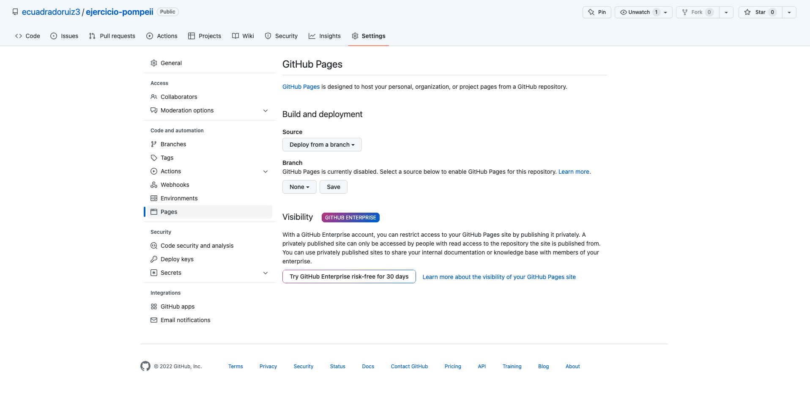
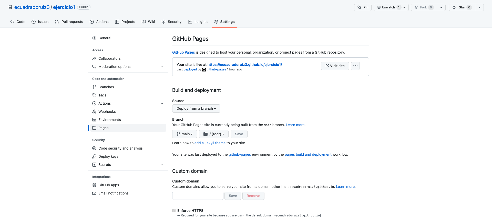

Github nos da la posibilidad de alojar webs estáticas de manera gratuita.

Para ello, una vez creado nuestro repositorio vamos a la sección ‘settings/pages’

¡ Seleccionando la rama podemos dar visibilidad a nuestra página de manera gratuita !

