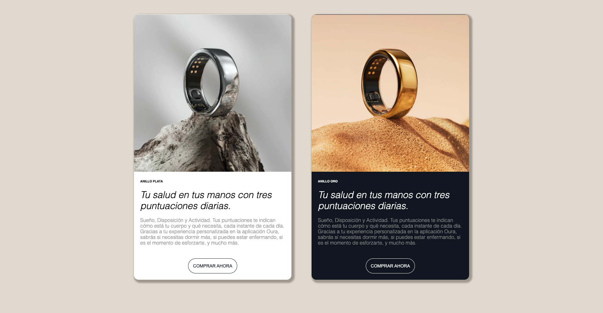

[Ejercicio](recursos/oura-rings.zip)

--- 


Llega el momento de practicar todo lo aprendido en esta sesión, y vamos a hacerlo con estas tarjetas de producto:



La idea es:

- Aplicar metodología de naming BEM
- Aplicar lo aprendido en SCSS (mixins, anidamientos, variables…)
- Subir el ejercicio a GIT PAGES

Primero creamos la estructura de HTML y preparamos las clases:

```html
<div class="card">
        <div class="card__header">
            
        </div>
        <div class="card__body">
          <h2 class="card__title">Anillo Plata</h2>
          <h3 class="card__subtitle">
            Tu salud en tus manos con tres puntuaciones diarias.
          </h3>
          <p class="card__copy">
            Sueño, Disposición y Actividad. Tus puntuaciones te indican cómo está tu cuerpo y qué necesita, 
            cada instante de cada día. Gracias a tu experiencia personalizada en la aplicación Oura, 
            sabrás si necesitas dormir más, si puedes estar enfermando, si es el momento de esforzarte, y mucho más.
          </p>
        </div>
        <footer class="card__footer">
            <button class="button">
              COMPRAR AHORA
            </button>
        </footer>
    </div>
```
