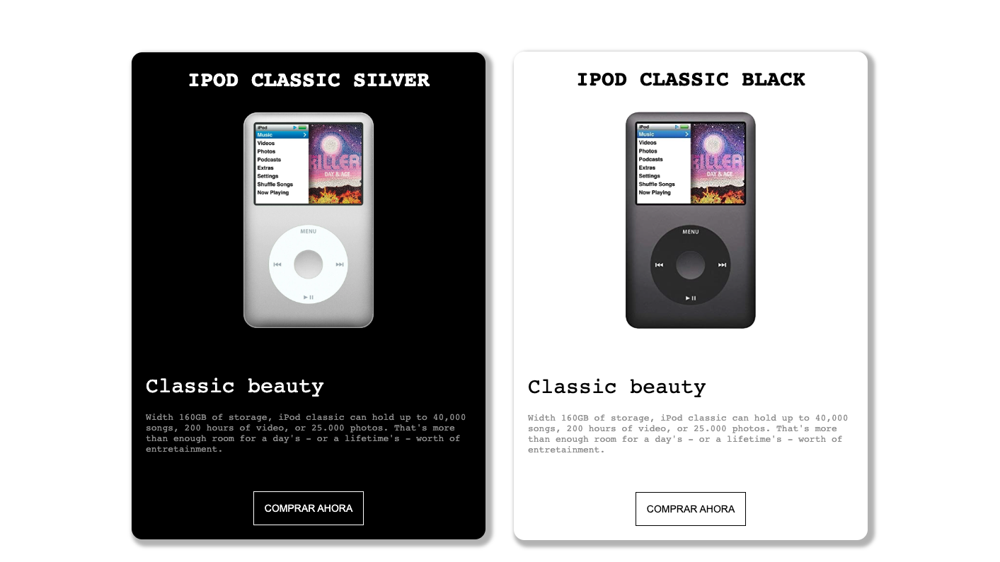

¡LLega vuestro turno!

Para asentar conocimientos de BEM y SCSS os pedimos que trabajéis con el siguiente diseño:

Es muy similar al ejercicio de OURA así que os pedimos:

- Trabajar con metodología BEM
- Crear estilos con SCSS
- Subir el ejercicio a githup pages

En cuanto a diseño:

- La letra es monospace
- Os dejamos las dos imágenes para que las descarguéis
    
    [assets.zip](recursos/assets.zip)
    
- Los colores son ( white, black, lightgray)

¡A por ello!